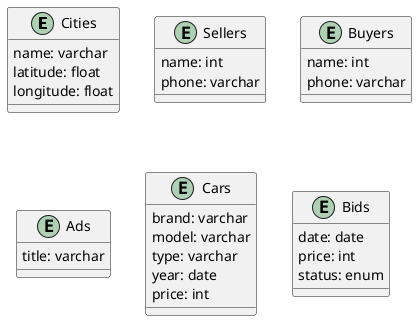
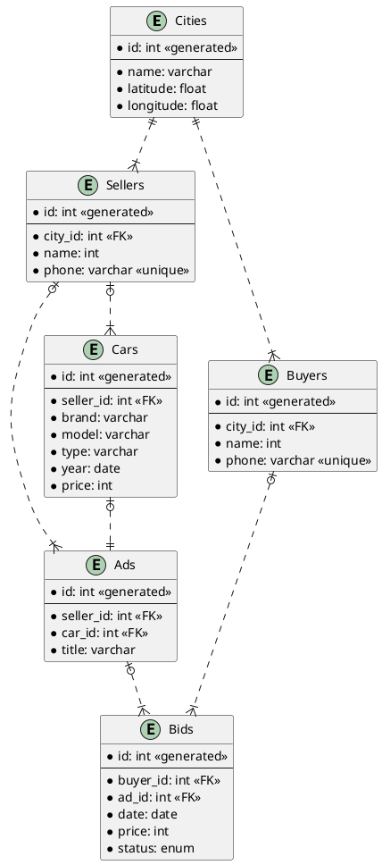

# DATABASE DESIGN FOR USED CAR DEALERS

## Backgound

This my final project for RDMS using PostgreSQL.....

## Objective

- Create database design for used car dealers
- Implement database design to database server
- Create and input dummy data for each table
- Test Backup and restore database
- Creating Transactional Query and Analytical Query

## Requirements

- PostgreSQL
- PostgreSQL Client (psql, DBeaver, pgAdmin etc)
- Python3

## Create Database Design

### Entities and Attributes

### Relations

- Seller can sell more than one Car
- Seller can advertise the Car
- One Car has only one Ad
- Buyer can bid more than one Ad
- Buyers and Sellers can have the same Domicili

### Table Structure, Relations and Constraint (Business Rules)

## Implementation To The Database Server
